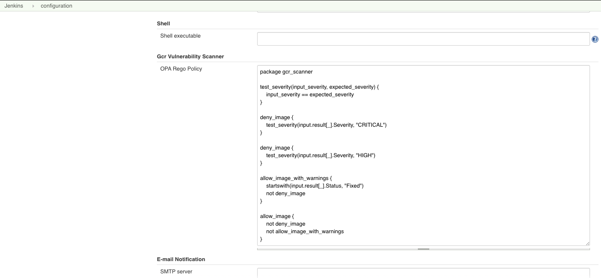
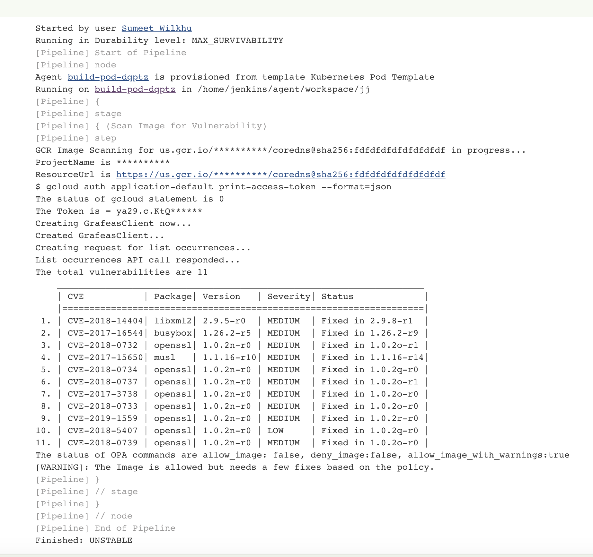

GCR Vulnerability Scanner for Jenkins
=====================================

Jenkins plugin to get the list of vulnerabilities for an image in Google Container registry
and use OPA policy to evaluate the vulnerabilities against the policy that is configurable for your needs.

# Generic Setup
### Prerequisites
* Install gcr_scanner plugin in Jenkins
* The plugin assumes that `GOOGLE_APPLICATION_CREDENTIALS` are going to be set in the build environment of Pipeline or
FreeStyle job.
* If you are using workload identity in kubernetes environment, you don't need to provide
`GOOGLE_APPLICATION_CREDENTIALS`
* For sake of uniqueness in images, you'll have to provide image digest instead of image with TAG.

The plugin is loaded with a default Rego policy for OPA evaluation when you run the builds for an image in your GCR but
if you want you can go to global configuration and update the policy for your needs. Please make sure that the policy
returns 3 unique values
* allow_image
* deny_image
* allow_image_with_warnings

Following is an example policy that will be automatically loaded in the jenkins when you install the plugin.


# Pipeline support

The plugin can be used in FreeStyle jobs as well as Pipeline. Here's an example for a declarative pipeline
```groovy
pipeline {
   agent {
       label "slave-pod"
   }
   parameters {
       string(name: 'IMAGE_DIGEST', defaultValue: 'us.gcr.io/project/helloworld@sha25677972347', description: '')
   }

   stages {
      stage('GCR Scan image') {
          gcrImageVulnerabilityScanner imageName: '${params.IMAGE_DIGEST}'
      }
   }
}

Here's how the output looks like.


```